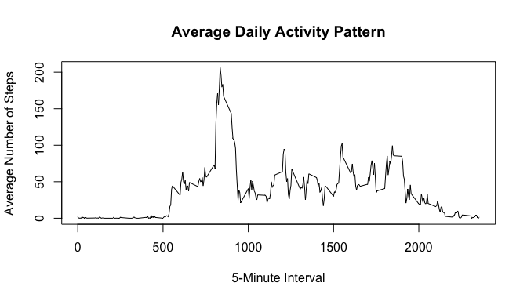
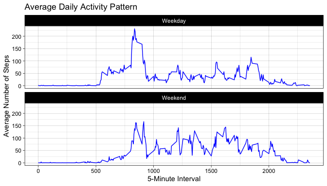

# Loading and preprocessing the data

First, load the data.


``` r
data <- read.csv(unz("activity.zip", "activity.csv"))
```

Now, transform the data so the date column is in date format.


``` r
data$date <- as.Date(data$date, format = "%Y-%m-%d")
```

# What is mean total number of steps taken per day?

This is a histogram of the total number of steps taken each day:


``` r
#calculate the total number of steps per day while ignoring NAs
daily_steps <- tapply(data$steps, data$date, sum, na.rm = TRUE)
#create histogram with daily_steps
hist(daily_steps, 
        main = "Total Steps per Day",
        xlab = "Total Steps",
        col = "green",
        breaks = 10
        )
```

<!-- -->

The mean number of steps taken is 9354.2295082.
The median number os steps taken is 10395.

The code to generate these values are below: 


``` r
mean(daily_steps)
```

```
## [1] 9354.23
```

``` r
median(daily_steps)
```

```
## [1] 10395
```


# What is the average daily activity pattern?

This is a time series line plot of the average daily activity pattern:


``` r
#find mean of each interval
interval_ave <- with(data, tapply(steps, interval, mean, na.rm = TRUE))

#create line plot of average activity pattern
plot(as.numeric(names(interval_ave)), interval_ave, type = "l",
        main = "Average Daily Activity Pattern",
        xlab = "5-Minute Interval",
        ylab = "Average Number of Steps")
```

<!-- -->

The 5-minute interval 835 contains the maximum average number of steps which is 206.1698113.

The code to generate these values are below: 


``` r
names(interval_ave)[which.max(interval_ave)]
```

```
## [1] "835"
```

``` r
max(interval_ave, na.rm = TRUE)
```

```
## [1] 206.1698
```


# Imputing missing values

The steps column contains 2304 missing values.

These missing values are  replaced with the mean for that 5-minute interval to create a new column in the data set that is equal to the original steps column but with the missing data filled in.


``` r
#create a copy of the steps column
data$steps_noNAs <- data$steps
#find the indices where steps are missing
na_indices <- is.na(data$steps_noNAs)
#relace NAs with 'interval_ave' values
data$steps_noNAs[na_indices] <- interval_ave[as.character(data$interval[na_indices])]
#check steps_copy for NAs
sum(is.na(data$steps_noNAs))
```

```
## [1] 0
```

Now a new average daily activity pattern is regenerated and discussed. 

I anticipate that this will yeild the exact same results as the original data since replacing the missing values with the mean for that interval will not change the mean interval value in any way, due to the nature of how mean is calculate. 

Below is the histogram with missing values replaced by the average by interval: 


``` r
#find mean of new intervals with Nas replaced
internal_ave_noNAs <- with(data, tapply(steps_noNAs, interval, mean, na.rm = TRUE))
#plot averagre steps per interval with a line plot
plot(as.numeric(names(internal_ave_noNAs)), internal_ave_noNAs, type = "l",
     main = "Average Daily Activity Pattern with Missing Values Replaced",
     xlab = "5-Minute Interval",
     ylab = "Average Number of Steps",
     col = "blue")
```

<!-- -->


The 5-minute interval 835 contains the maximum average number of steps which is 206.1698113.

The code to generate these values are below: 


``` r
(internal_ave_noNAs)[which.max(internal_ave_noNAs)]
```

```
##      835 
## 206.1698
```

``` r
max(internal_ave_noNAs)
```

```
## [1] 206.1698
```

As expected these values are the same as before and the lot generated is hte same as before since replacing the missing values with the average by 5 minute interval will have no effect on hte overall mean per interval because of hte nature of how mean is calulate.  

# Are there differences in activity patterns between weekdays and weekends?

Below a new factored column with two levels, Weekday and Weekend, and the activity pattern from weekdays and weekends are compared in a line plot. 


``` r
#create new column that labels all sat/sun weekend, and all else weekday.
data$dayType <- ifelse(weekdays(data$date) %in% c("Saturday", "Sunday"), "Weekend", "Weekday")
#convert to factor
data$dayType <- factor(data$dayType, levels = c("Weekday", "Weekend"))
#aggregate average steps per interval by dayType
avg_interval <- aggregate(steps_noNAs ~ interval + dayType, data = data, FUN = mean)
#panel plot containing two time series plot of activity across all weekdays or weekends
library(ggplot2)
ggplot(avg_interval, aes(x = interval, y = steps_noNAs)) +
    geom_line(color = "blue") +
    facet_wrap(~ dayType, ncol = 1) +
    labs(title = "Average Daily Activity Pattern",
         x = "5-Minute Interval",
         y = "Average Number of Steps") +
    theme_linedraw()
```

<!-- -->

We can see from this graph that the activity levels vary slightly across time between weekdays and weekends, with participates being more active in early hours of the day on weekdays and having a more sustained level of activy across the day during weekends. 
